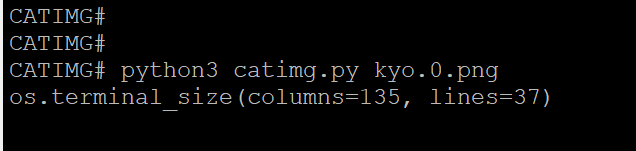

# catimg
show image on server without X display  installed 

## Usage

        1. on a server without X-display installed

        2. adjust the terminal size,
           more small, more clear, more slow
           
 

        3. python3 catimg.py xxxxx.png
 
  
        
        4. cat _xxxxx.png.txt 
  
  
  
  
        5. the result generated in a very 7-point fontsize terminal
        
  
  
  
## Others

just map the bgr color-space to ansi-256 color-space
handled pixel-by-pixel, so its slow................
